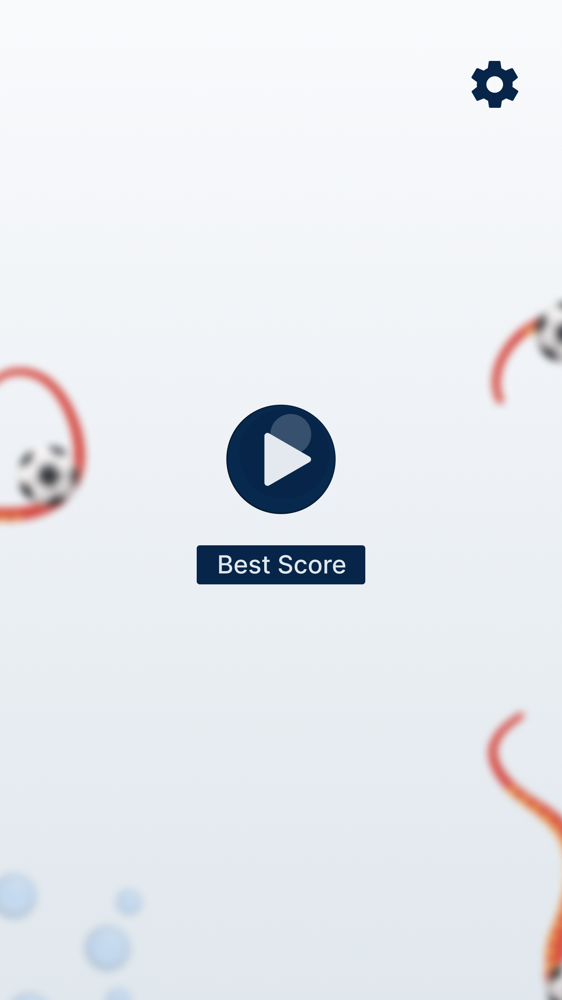
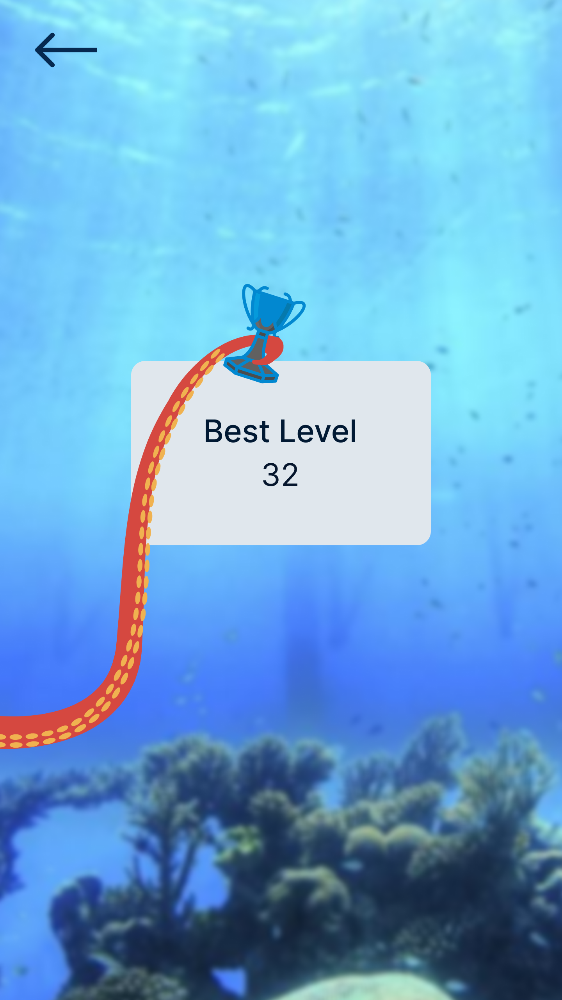
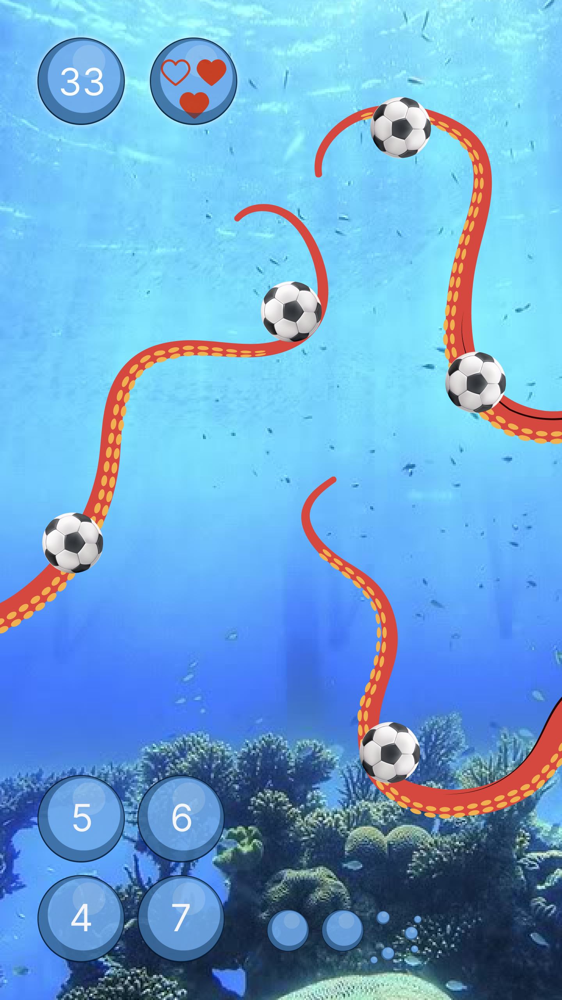

# football_tentacles

    

https://user-images.githubusercontent.com/96408557/188462934-b88549ad-2398-4d8e-b8ac-3ec8365b41a0.mp4

[comment]: <> (A new Flutter project.)

[comment]: <> (## Getting Started)

[comment]: <> (This project is a starting point for a Flutter application.)

[comment]: <> (A few resources to get you started if this is your first Flutter project:)

[comment]: <> (- [Lab: Write your first Flutter app]&#40;https://docs.flutter.dev/get-started/codelab&#41;)

[comment]: <> (- [Cookbook: Useful Flutter samples]&#40;https://docs.flutter.dev/cookbook&#41;)

[comment]: <> (For help getting started with Flutter development, view the)

[comment]: <> ([online documentation]&#40;https://docs.flutter.dev/&#41;, which offers tutorials,)

[comment]: <> (samples, guidance on mobile development, and a full API reference.)
